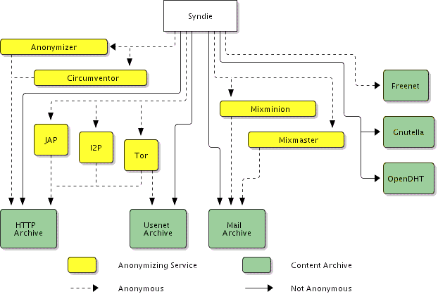

# Syndie Python

A fork of the Distributed Network Agnostic Forum software: [Syndie][1], which offers a secure and consistent interface to various anonymous and non-anonymous content networks.

## What it is

* [Features][2]
* [Use Cases][3]
* [FAQ][4]
* [Related projects][5]

## Where to get it

You can find the Java version here:

* [On the clearnet][1]
* [And over I2P][6]

## Contact

* [The Syndie forums][7] hosted on the I2P network

_Syndie's code is entirely open source - unless otherwise specified, all code and content contained in the Syndie releases are put out into the public domain. Although the project is free and open source software, [donations][8] are welcome, be they code or cash._

[1]: https://syndie.de/index.html
[2]: https://syndie.de/features.html
[3]: https://syndie.de/usecases.html
[4]: https://syndie.de/faq.html
[5]: https://syndie.de/related.html
[6]: http://salt.i2p/wiki/index.php/Main_Page#Syndie
[7]: http://www.forum.i2p/viewforum.php?f=29
[8]: https://syndie.de/donate.html
